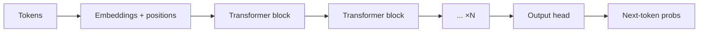
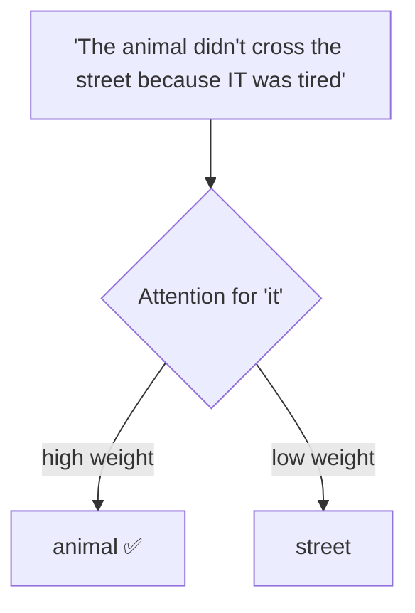
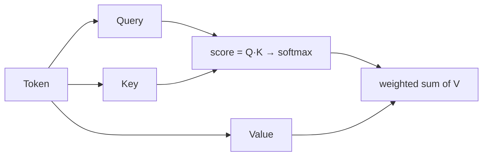
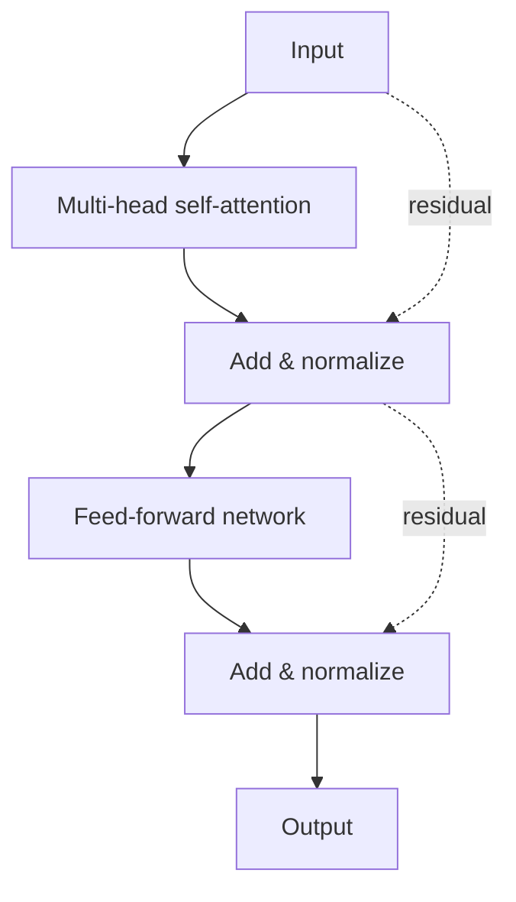
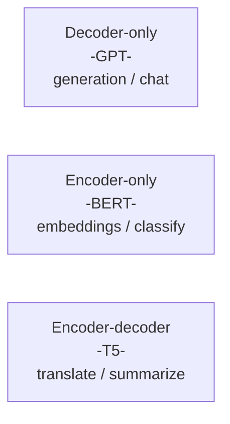
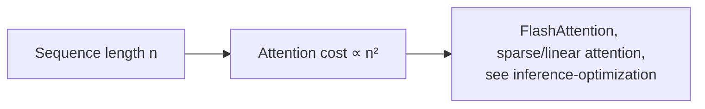

# ⚙️ Transformers

> **One-liner:** The **transformer** is the neural network architecture behind virtually
> every modern LLM. Its superpower is **self-attention** — letting every token look at
> every other token to figure out meaning in context. ("Attention Is All You Need," 2017.)

---

## 👀 Self-attention — the core idea

For each token, attention asks: *"which other tokens should I pay attention to?"* — and
mixes their information accordingly. That's how the model resolves what "it" refers to.

Mechanically, each token produces a **Query, Key, and Value**; attention scores every
Query against every Key, then blends the Values:

- **Multi-head attention** runs several attention "heads" in parallel, each learning different relationships (syntax, coreference, etc.).

---

## 🧱 Inside a transformer block

Stack N of these blocks (dozens to over a hundred) and you have the model. **Residual
connections** and **normalization** keep very deep stacks trainable.

---

## 📍 Positional encoding

Attention alone has no sense of order. **Positional encodings** inject "where each token
sits" so the model knows sequence order.

| Type | Note |
|------|------|
| Sinusoidal / learned | Original approaches |
| **RoPE** (rotary) | Common in modern LLMs; helps with longer contexts |
| ALiBi | Biases attention by distance |

---

## 🧭 Three transformer shapes

Modern LLMs are overwhelmingly **decoder-only**: they generate text left-to-right, each
token attending only to previous tokens (**causal / masked attention**).

---

## ⏳ The quadratic problem

Self-attention compares every token to every other → cost grows with the **square** of
sequence length. This is why long contexts are expensive and why there's constant work on
efficient attention.

➡️ See how this gets faster in practice → **[inference-optimization](../inference-optimization/)**.
Or how tokens become vectors → **[embeddings](../embeddings/)**.
