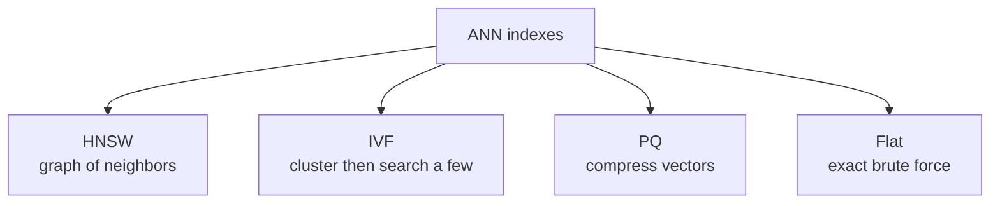
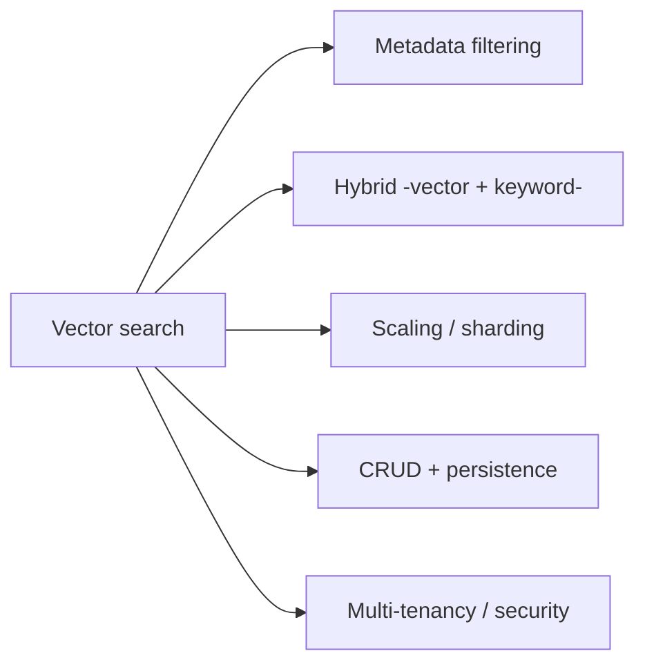
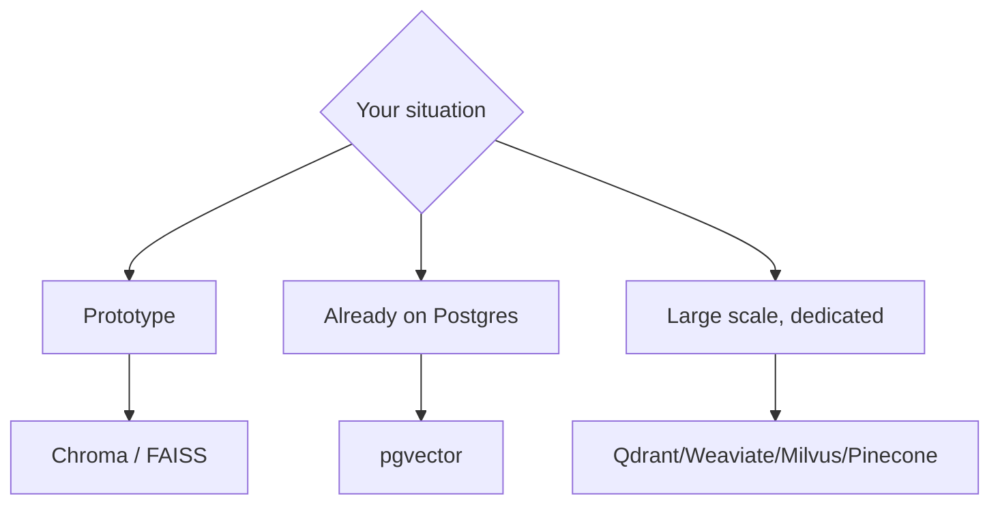

# 🗄️ Vector Databases

> **One-liner:** A vector database stores [embeddings](../embeddings/) and finds the
> **nearest** ones to a query vector — fast — using **Approximate Nearest Neighbor (ANN)**
> indexes. It's the storage + search engine that makes [RAG](../rag/) and semantic search work at scale.

---

## ⚡ Why not just compare all vectors?

Comparing a query against **millions** of vectors one by one (brute force / "flat") is
accurate but too slow. ANN indexes trade a **tiny** bit of accuracy for **massive** speed.

---

## 🧭 The main ANN index types

| Index | Idea | Trade-off |
|-------|------|-----------|
| **HNSW** | Navigable small-world graph; hop toward nearest | Great speed/recall; more memory |
| **IVF** | Partition into clusters; search only nearby clusters | Fast; needs training/tuning |
| **PQ** (Product Quantization) | Compress vectors to save memory | Smaller/faster; some accuracy loss |
| **Flat** | Exact search | Perfect recall; slow at scale |

Often combined (e.g. **IVF-PQ**, **HNSW-PQ**).

---

## 🎛️ Beyond similarity: what a vector DB adds

- **[Metadata filtering](../rag/retrieval.md)** — "only search docs from 2024, region=EU."
- **[Hybrid search](../rag/retrieval.md)** — combine vector + keyword (BM25).
- **Scale & durability** — sharding, replication, updates, deletes.

---

## 🧰 The landscape

| Option | Flavor |
|--------|--------|
| **FAISS** | Library (not a DB); very fast, local, DIY |
| **Chroma** | Lightweight, great for prototyping |
| **Qdrant / Weaviate / Milvus** | Full-featured dedicated vector DBs |
| **pgvector** | Postgres extension — vectors beside relational data |
| **Elasticsearch / OpenSearch** | Search engines with vector support |
| **Pinecone** | Managed, serverless |

---

## 🗺️ Where vector DBs are used

- **[RAG](../rag/)** retrieval (the headline use case)
- **Semantic search** over any corpus
- **[Agent memory](../agents/memory.md)** (long-term recall)
- **Recommendations, dedup, anomaly detection**

➡️ Powered by **[embeddings](../embeddings/)** · feeds **[RAG retrieval](../rag/retrieval.md)**.
