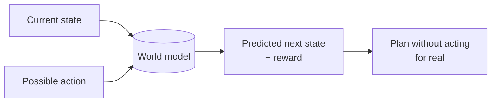
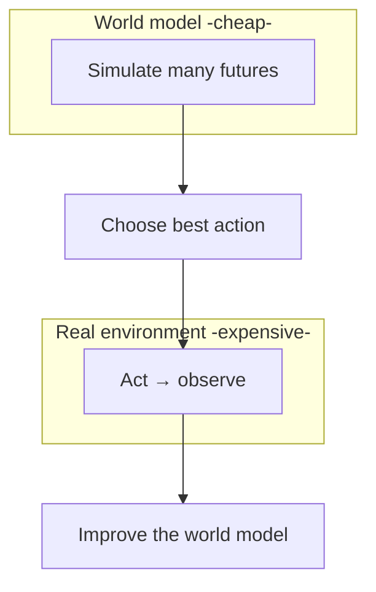
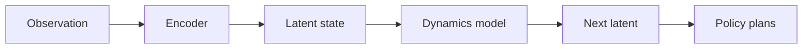
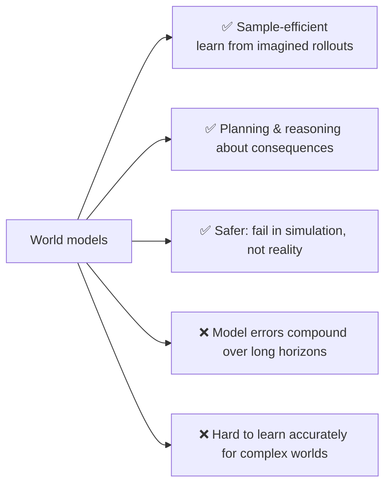

# 🌍 World Models

> **One-liner:** A world model is an AI's **internal simulation of how an environment works**
> — it learns to *predict what happens next* so an agent can "imagine" outcomes and plan
> before acting, instead of learning only by trial and error in the real world.

---

## 💡 The idea: learn to imagine

Instead of acting in the real (slow, costly, risky) world every time, the agent **rolls out
futures inside its learned model** — "dreaming" — and picks the best plan.

---

## 🧩 Typical components

| Part | Role |
|------|------|
| **Encoder** | Compress observations into a latent state |
| **Dynamics model** | Predict next latent state given an action |
| **Reward model** | Predict reward/outcome |
| **Planner / policy** | Use predictions to choose actions |

---

## ⚖️ Why they matter

---

## 🔗 Where they connect to LLMs

- Some argue LLMs learn an **implicit world model** of language/world from pretraining;
  it's debated how deep that goes.
- **Video-generation models** ([diffusion](../diffusion-models/)-style) are increasingly framed
  as world models that predict future frames — useful for robotics & simulation.
- Relevant to **[agents](../agents/)**: a good world model = better [planning](../agents/architectures.md)
  in the [agentic loop](../agentic-loop/).

---

## 🗺️ Where world models are used

- **Reinforcement learning** & robotics (sample-efficient learning, sim-to-real).
- **Autonomous systems** (self-driving: predict other agents' moves).
- **Game-playing agents** (plan by imagining outcomes).
- **Embodied AI** and physical-world reasoning.

> 🧭 Big-picture: many researchers see richer world models as a path toward more general,
> grounded reasoning — models that understand *cause and effect*, not just text patterns.

➡️ Related: **[agents](../agents/)** · **[reasoning-models](../reasoning-models/)** · **[diffusion-models](../diffusion-models/)**.
